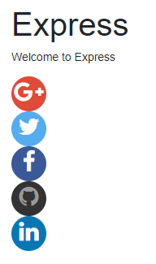

# oauth

This project is generated using [express-generator](https://expressjs.com/en/starter/generator.html)

Start by running `npm run build` - works for Linux/Mac, add 'set' for windows in package.json

I have set up:

* [facebook](https://developers.facebook.com/apps/)
* [twitter](https://apps.twitter.com/)
* [linkedin](https://www.linkedin.com/developer/apps)
* [github](https://github.com/settings/developers)
* [google+](https://console.developers.google.com/)

For this to work I had to fiddle around with my hosts file to fool the browser, because localhost was not my machine, but my raspberry pi. 

Just for the record, I have disabled all apps on above platform, so the keys won't work.

An example:

